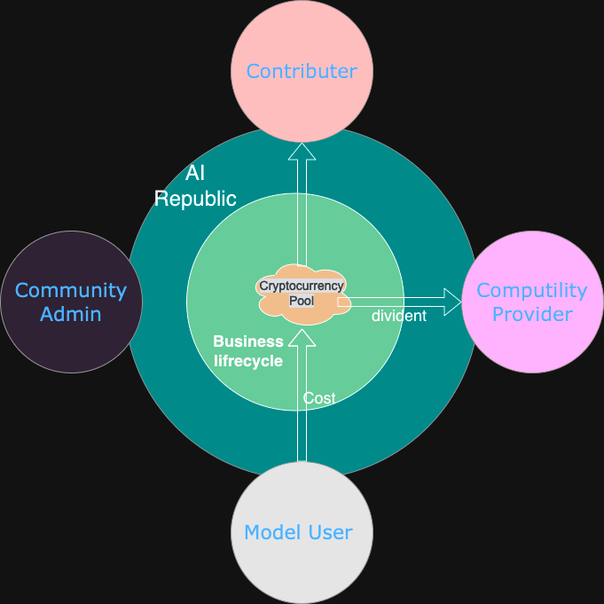

# AI Computility Republic

AI算力超级昂贵, 一次chatgpt的模型训练就得话费上千万美金.  以后可以想象会出现AI巨头, 而随着资本前期巨额投入, 收费, 垄断, 寡头难免会成为可预知的结果.
所以提出想法, 设计一套体系, 让普通开发者也能参与大模型的开发! 让AI掌握在普罗大众手中, 在未来的AI世界中人人平等!

## 角色
1. 系统开发贡献者
2. 算力提供者
3. 使用方
4. 社区维护者

## 构思图
